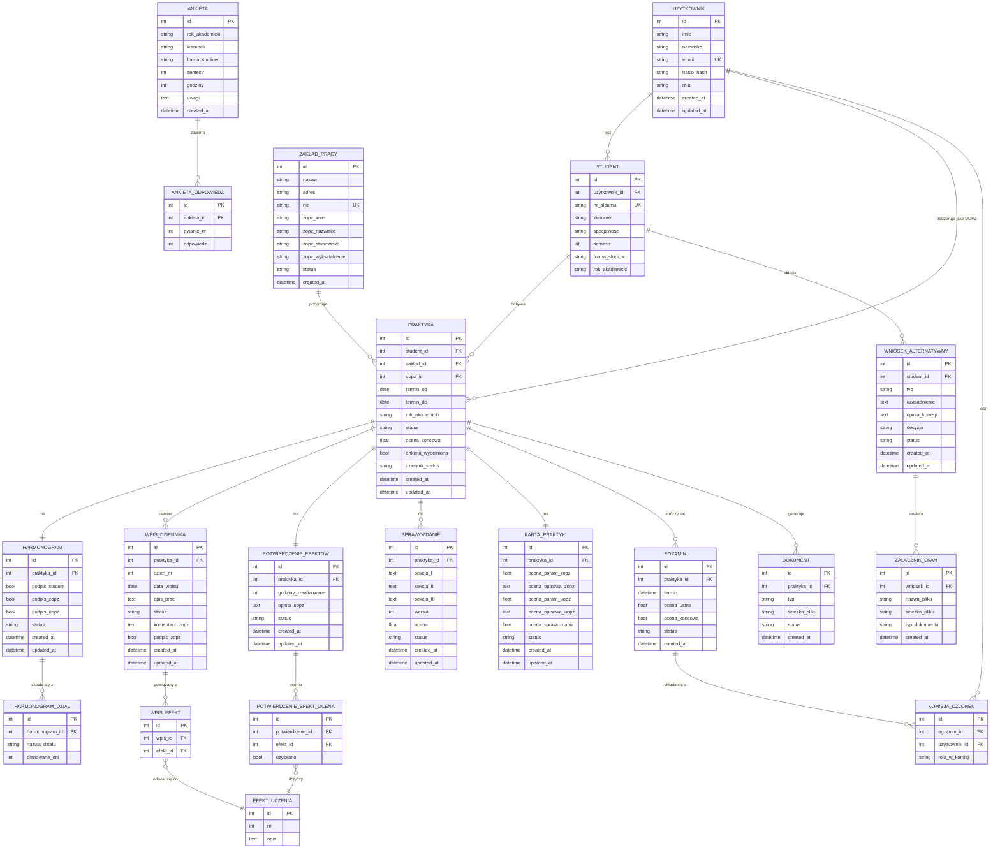

# ERD – System Obsługi Praktyk Zawodowych

Diagram encji wyprowadzony z załączników regulaminu praktyk (Zał. nr 2a, 3, 4, 4b, 5, 6, 7)
oraz logiki biznesowej zdefiniowanej w diagramach sekwencji (Procesy 1–9).

## Uwagi projektowe

- Status dziennika praktyk nie jest osobną encją — wynika z agregacji statusów wpisów w WPIS_DZIENNIKA oraz statusu PRAKTYKA.
- Egzamin poprawkowy modelowany jest jako kolejny rekord w tabeli EGZAMIN (relacja 1:N z PRAKTYKA).
- Wynik egzaminu przechowywany jest bezpośrednio w polach tabeli EGZAMIN (ocena_ustna, ocena_koncowa).

## Legenda relacji

| Oznaczenie | Znaczenie |
|---|---|
| `\|\|--\|\|` | dokładnie jeden do dokładnie jednego (1:1) |
| `\|\|--o{` | dokładnie jeden do wielu (1:N) |
| `}o--\|\|` | wiele do dokładnie jednego (N:1) |

## Tabele pośrednie (relacje N:M)

- `WPIS_EFEKT` — jeden wpis dziennika może realizować wiele efektów uczenia się
- `POTWIERDZENIE_EFEKT_OCENA` — każdy z 13 efektów oceniany osobno per potwierdzenie
- `KOMISJA_CZLONEK` — wielu użytkowników może zasiadać w komisji egzaminacyjnej

## Dozwolone wartości statusów

| Tabela | Dozwolone statusy |
|---|---|
| `PRAKTYKA` | Draft, Submitted, Under_Review, Approved, Rejected, Closed |
| `HARMONOGRAM` | Draft, Submitted, Under_Review, Approved, Rejected |
| `WPIS_DZIENNIKA` | Draft, Submitted, Approved, Rejected |
| `POTWIERDZENIE_EFEKTOW` | Draft, Submitted, Under_Review, Approved, Rejected |
| `SPRAWOZDANIE` | Draft, Submitted, Under_Review, Approved, Rejected |
| `KARTA_PRAKTYKI` | Draft, Under_Review, Approved, Closed |
| `WNIOSEK_ALTERNATYWNY` | Submitted, Under_Review, Approved, Rejected |
| `EGZAMIN` | Draft, Approved, Rejected |
| `ZAKLAD_PRACY` | Approved, Rejected |
| `DOKUMENT` | Closed |