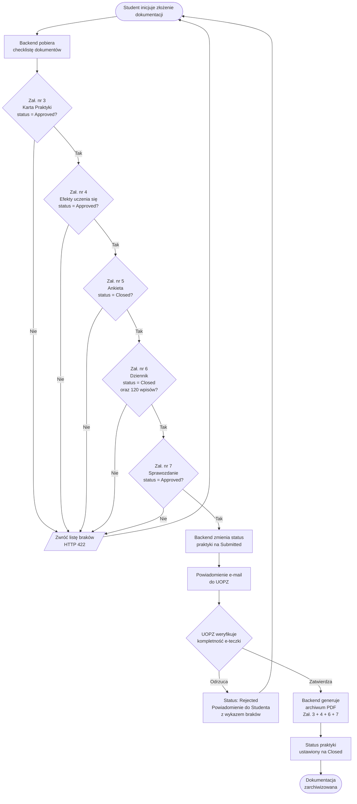

### Bonus — Flowchart: Logika biznesowa kompletacji dokumentacji

> Ten diagram pokrywa kluczowy mechanizm checklisty przed złożeniem e-teczki (Proces 6), który jest najtrudniejszy do wyrażenia samym diagramem sekwencji.

