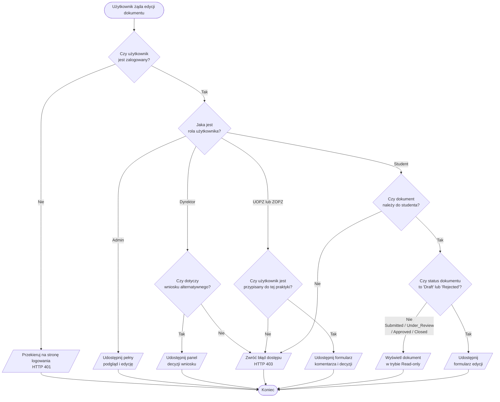

### Zadanie 3 — Flowchart: Logika uprawnień do edycji dokumentu

> Modeluje algorytm wykonywany przez backend przy każdej próbie edycji dokumentu. Pokrywa warunki z instrukcji: uwierzytelnienie, rola użytkownika, status dokumentu.

