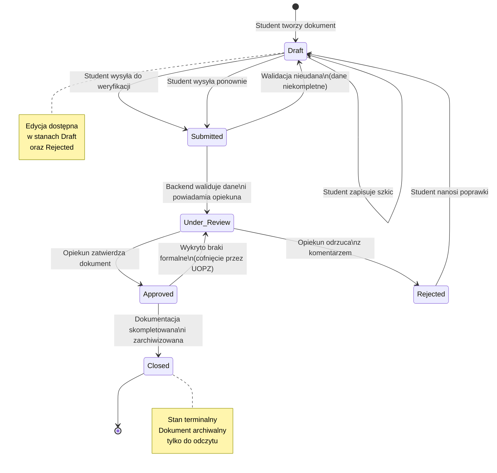

### Zadanie 2 — State Diagram: Cykl życia dokumentu

> Modeluje ogólny cykl życia dokumentu w systemie. Nie wszystkie encje przechodzą przez każdy stan — patrz tabela poniżej.

#### Mapowanie stanów na encje

> Nie każda encja wykorzystuje wszystkie stany z diagramu powyżej. Poniższa tabela precyzuje dozwolone przejścia:

| Encja | Draft | Submitted | Under_Review | Approved | Rejected | Closed |
|---|:---:|:---:|:---:|:---:|:---:|:---:|
| PRAKTYKA | ✓ | ✓ | ✓ | ✓ | ✓ | ✓ |
| HARMONOGRAM | ✓ | ✓ | ✓ | ✓ | ✓ | — |
| WPIS_DZIENNIKA | ✓ | ✓ | — | ✓ | ✓ | — |
| POTWIERDZENIE_EFEKTOW | ✓ | ✓ | ✓ | ✓ | ✓ | — |
| SPRAWOZDANIE | ✓ | ✓ | ✓ | ✓ | ✓ | — |
| KARTA_PRAKTYKI | ✓ | — | ✓ | ✓ | — | ✓ |
| WNIOSEK_ALTERNATYWNY | — | ✓ | ✓ | ✓ | ✓ | — |
| EGZAMIN | ✓ | — | — | ✓ | ✓ | — |
