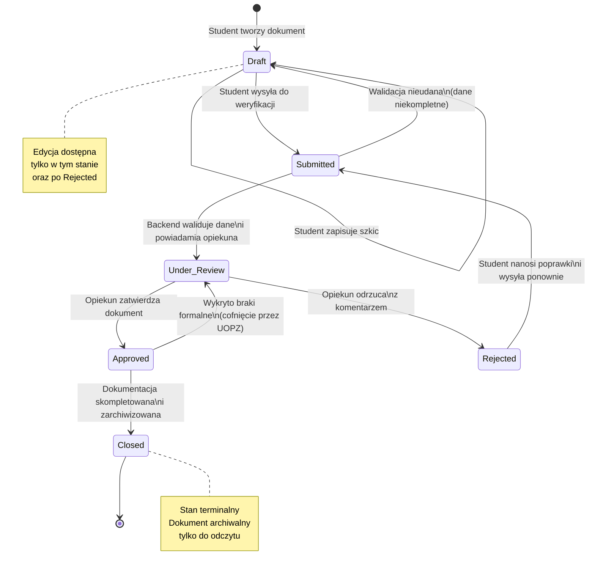

### Zadanie 2 — State Diagram: Cykl życia dokumentu

> Modeluje wszystkie stany przez które przechodzi dowolny dokument w systemie (Dziennik, Sprawozdanie, Wniosek, Karta Praktyki). Rozgałęzienie przy `Under_Review` odzwierciedla decyzję opiekuna.

