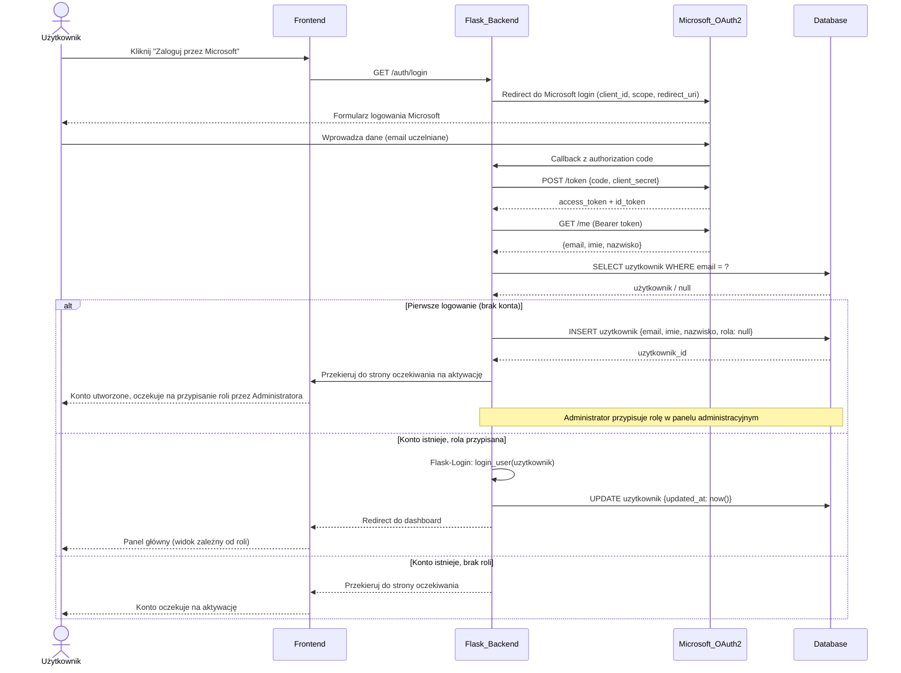

### Proces 0 — Uwierzytelnianie przez Microsoft OAuth2
> Logowanie do systemu odbywa się wyłącznie przez konto Microsoft (Azure AD). Przy pierwszym logowaniu system tworzy konto użytkownika i wymaga przypisania roli przez Administratora.

> **Uwaga:** System korzysta z Flask-Login do zarządzania sesjami (`login_user`, `logout_user`, `@login_required`). Rola użytkownika determinuje dostępne widoki i uprawnienia zgodnie z flowchartem logiki uprawnień.
