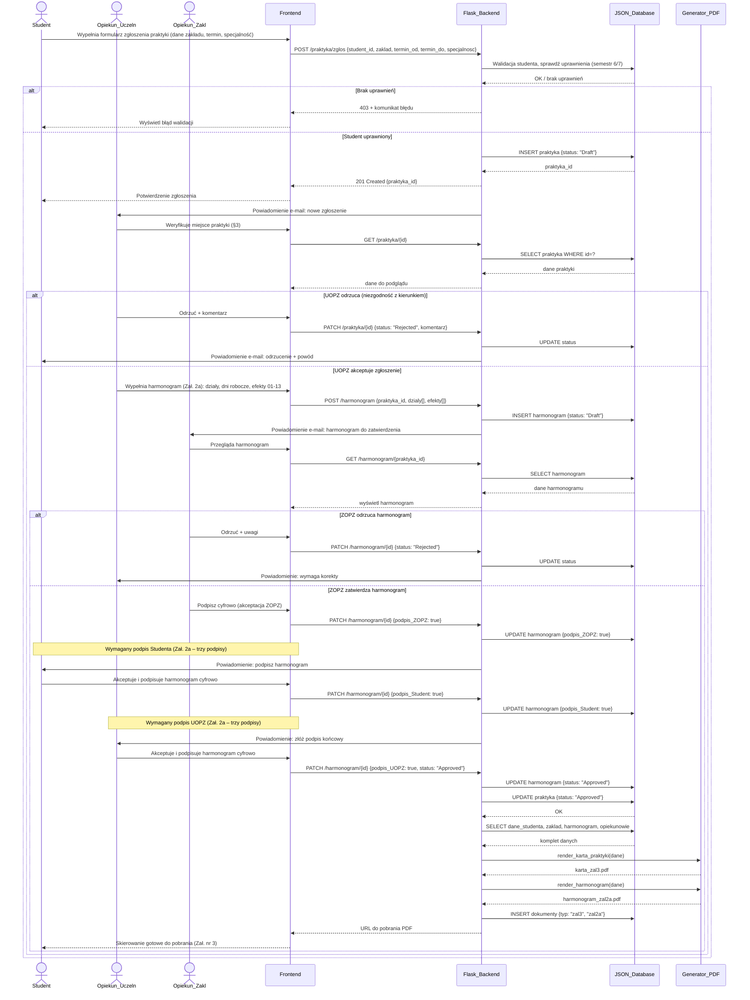

### Proces 1 — Rejestracja i konfiguracja praktyki
> Dane: Zał. nr 3 (dane zakładu, daty, skierowanie, BHP), Zał. nr 2a (efekty 01–13, harmonogram działów, podpisy UOPZ + ZOPZ + Student).

```mermaid
sequenceDiagram
    actor S as Student
    actor UOPZ as Opiekun_Uczeln
    actor ZOPZ as Opiekun_Zakl
    participant FE as Frontend
    participant FB as Flask_Backend
    participant J as JSON_Database
    participant PDF as Generator_PDF

    S->>FE: Wypełnia formularz zgłoszenia praktyki (dane zakładu, termin, specjalność)
    FE->>FB: POST /praktyka/zglos {student_id, zaklad, termin_od, termin_do, specjalnosc}
    FB->>J: Walidacja studenta, sprawdź uprawnienia (semestr 6/7)
    J-->>FB: OK / brak uprawnień

    alt Brak uprawnień
        FB-->>FE: 403 + komunikat błędu
        FE-->>S: Wyświetl błąd walidacji
    else Student uprawniony
        FB->>J: INSERT praktyka {status: "Draft"}
        J-->>FB: praktyka_id
        FB-->>FE: 201 Created {praktyka_id}
        FE-->>S: Potwierdzenie zgłoszenia

        FB->>UOPZ: Powiadomienie e-mail: nowe zgłoszenie
        UOPZ->>FE: Weryfikuje miejsce praktyki (§3)
        FE->>FB: GET /praktyka/{id}
        FB->>J: SELECT praktyka WHERE id=?
        J-->>FB: dane praktyki
        FB-->>FE: dane do podglądu

        alt UOPZ odrzuca (niezgodność z kierunkiem)
            UOPZ->>FE: Odrzuć + komentarz
            FE->>FB: PATCH /praktyka/{id} {status: "Rejected", komentarz}
            FB->>J: UPDATE status
            FB->>S: Powiadomienie e-mail: odrzucenie + powód
        else UOPZ akceptuje zgłoszenie
            UOPZ->>FE: Wypełnia harmonogram (Zał. 2a): działy, dni robocze, efekty 01-13
            FE->>FB: POST /harmonogram {praktyka_id, dzialy[], efekty[]}
            FB->>J: INSERT harmonogram {status: "Draft"}
            FB->>ZOPZ: Powiadomienie e-mail: harmonogram do zatwierdzenia

            ZOPZ->>FE: Przegląda harmonogram
            FE->>FB: GET /harmonogram/{praktyka_id}
            FB->>J: SELECT harmonogram
            J-->>FB: dane harmonogramu
            FB-->>FE: wyświetl harmonogram

            alt ZOPZ odrzuca harmonogram
                ZOPZ->>FE: Odrzuć + uwagi
                FE->>FB: PATCH /harmonogram/{id} {status: "Rejected"}
                FB->>J: UPDATE status
                FB->>UOPZ: Powiadomienie: wymaga korekty
            else ZOPZ zatwierdza harmonogram
                ZOPZ->>FE: Podpisz cyfrowo (akceptacja ZOPZ)
                FE->>FB: PATCH /harmonogram/{id} {podpis_ZOPZ: true}
                FB->>J: UPDATE harmonogram {podpis_ZOPZ: true}

                Note over S,FE: Wymagany podpis Studenta (Zał. 2a – trzy podpisy)
                FB->>S: Powiadomienie: podpisz harmonogram
                S->>FE: Akceptuje i podpisuje harmonogram cyfrowo
                FE->>FB: PATCH /harmonogram/{id} {podpis_Student: true}
                FB->>J: UPDATE harmonogram {podpis_Student: true}

                Note over UOPZ,FE: Wymagany podpis UOPZ (Zał. 2a – trzy podpisy)
                FB->>UOPZ: Powiadomienie: złóż podpis końcowy
                UOPZ->>FE: Akceptuje i podpisuje harmonogram cyfrowo
                FE->>FB: PATCH /harmonogram/{id} {podpis_UOPZ: true, status: "Approved"}
                FB->>J: UPDATE harmonogram {status: "Approved"}
                FB->>J: UPDATE praktyka {status: "Approved"}
                J-->>FB: OK

                FB->>J: SELECT dane_studenta, zaklad, harmonogram, opiekunowie
                J-->>FB: komplet danych
                FB->>PDF: render_karta_praktyki(dane)
                PDF-->>FB: karta_zal3.pdf
                FB->>PDF: render_harmonogram(dane)
                PDF-->>FB: harmonogram_zal2a.pdf
                FB->>J: INSERT dokumenty {typ: "zal3", "zal2a"}
                FB-->>FE: URL do pobrania PDF
                FE-->>S: Skierowanie gotowe do pobrania (Zał. nr 3)
            end
        end
    end
```
