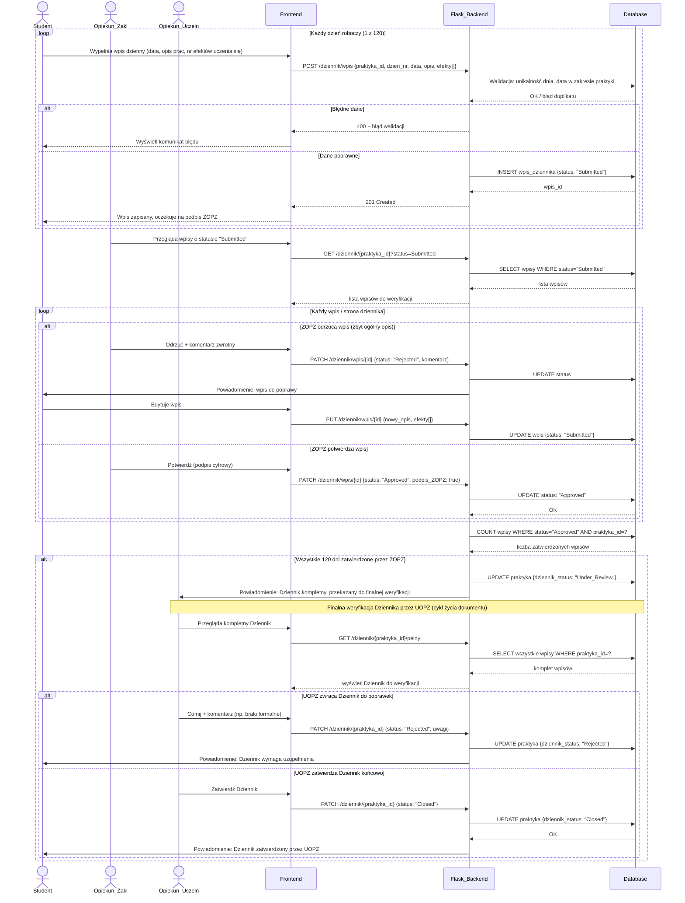

### Proces 2 — Codzienny dziennik praktyki
> Dane: Zał. nr 6 (kolejny dzień 1–120, data, opis wykonanych prac, nr efektów 01–13, podpis osoby nadzorującej, potwierdzenie całej strony przez wymaganych użytkowników).

> **Uwaga:** Status dziennika (Under_Review, Rejected, Closed) jest polem w tabeli PRAKTYKA, nie osobną encją.
