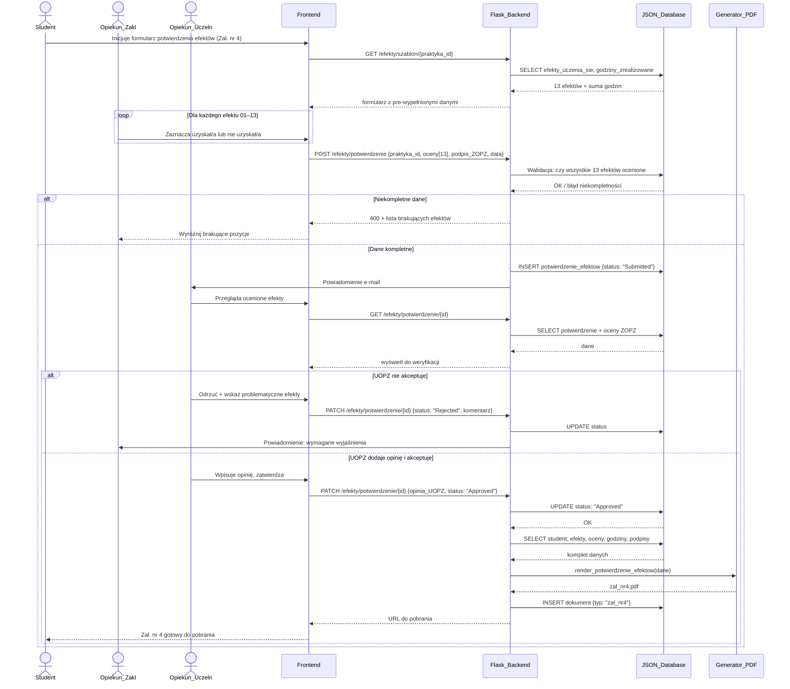

### Proces 3 — Potwierdzenie efektów uczenia się
> Dane: Zał. nr 4 (13 efektów: uzyskał/nie uzyskał, łączna liczba godzin, podpis + pieczęć ZOPZ, opinia UOPZ, daty).

```mermaid
sequenceDiagram
    actor S as Student
    actor ZOPZ as Opiekun_Zakl
    actor UOPZ as Opiekun_Uczeln
    participant FE as Frontend
    participant FB as Flask_Backend
    participant J as JSON_Database
    participant PDF as Generator_PDF

    S->>FE: Inicjuje formularz potwierdzenia efektów (Zał. nr 4)
    FE->>FB: GET /efekty/szablon/{praktyka_id}
    FB->>J: SELECT efekty_uczenia_sie, godziny_zrealizowane
    J-->>FB: 13 efektów + suma godzin
    FB-->>FE: formularz z pre-wypełnionymi danymi

    loop Dla każdego efektu 01–13
        ZOPZ->>FE: Zaznacza uzyskał/a lub nie uzyskał/a
    end
    FE->>FB: POST /efekty/potwierdzenie {praktyka_id, oceny[13], podpis_ZOPZ, data}
    FB->>J: Walidacja: czy wszystkie 13 efektów ocenione
    J-->>FB: OK / błąd niekompletności

    alt Niekompletne dane
        FB-->>FE: 400 + lista brakujących efektów
        FE-->>ZOPZ: Wyróżnij brakujące pozycje
    else Dane kompletne
        FB->>J: INSERT potwierdzenie_efektow {status: "Submitted"}
        FB->>UOPZ: Powiadomienie e-mail

        UOPZ->>FE: Przegląda ocenione efekty
        FE->>FB: GET /efekty/potwierdzenie/{id}
        FB->>J: SELECT potwierdzenie + oceny ZOPZ
        J-->>FB: dane
        FB-->>FE: wyświetl do weryfikacji

        alt UOPZ nie akceptuje
            UOPZ->>FE: Odrzuć + wskaż problematyczne efekty
            FE->>FB: PATCH /efekty/potwierdzenie/{id} {status: "Rejected", komentarz}
            FB->>J: UPDATE status
            FB->>ZOPZ: Powiadomienie: wymagane wyjaśnienia
        else UOPZ dodaje opinię i akceptuje
            UOPZ->>FE: Wpisuje opinię, zatwierdza
            FE->>FB: PATCH /efekty/potwierdzenie/{id} {opinia_UOPZ, status: "Approved"}
            FB->>J: UPDATE status: "Approved"
            J-->>FB: OK
            FB->>J: SELECT student, efekty, oceny, godziny, podpisy
            J-->>FB: komplet danych
            FB->>PDF: render_potwierdzenie_efektow(dane)
            PDF-->>FB: zal_nr4.pdf
            FB->>J: INSERT dokument {typ: "zal_nr4"}
            FB-->>FE: URL do pobrania
            FE-->>S: Zał. nr 4 gotowy do pobrania
        end
    end
```
