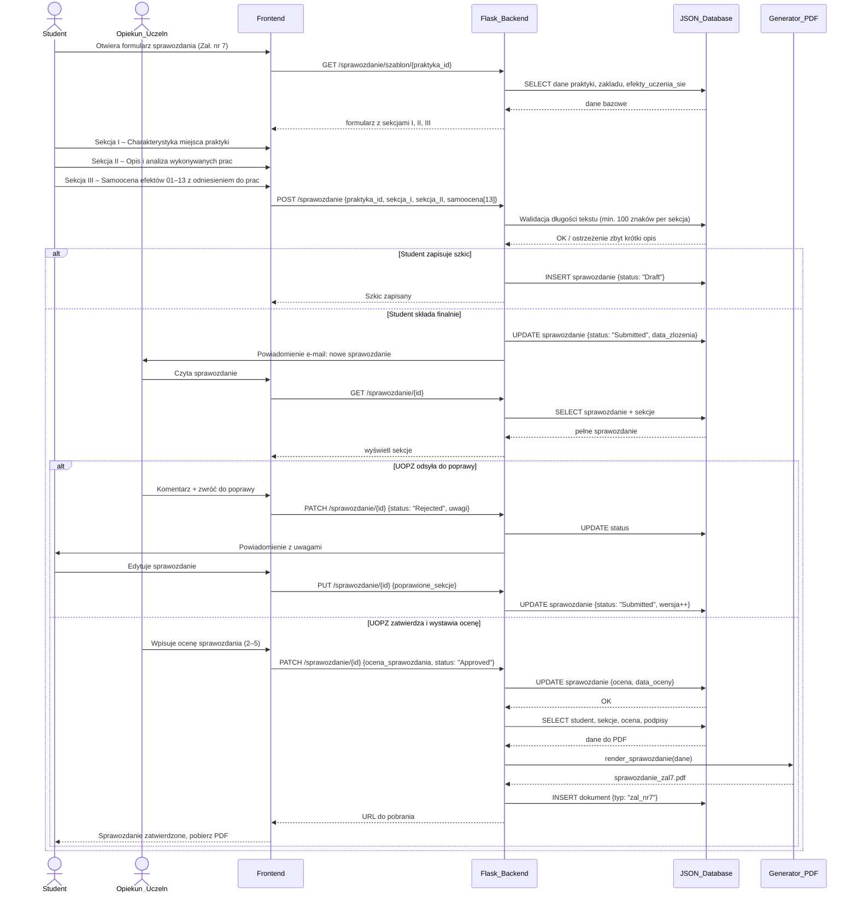

### Proces 4 — Sprawozdanie końcowe studenta
> Dane: Zał. nr 7 (sekcja I: charakterystyka miejsca, sekcja II: opis i analiza prac, sekcja III: samoocena efektów 01–13 z odniesieniem do wykonanych prac; ocena sprawozdania przez UOPZ w skali 2–5).

