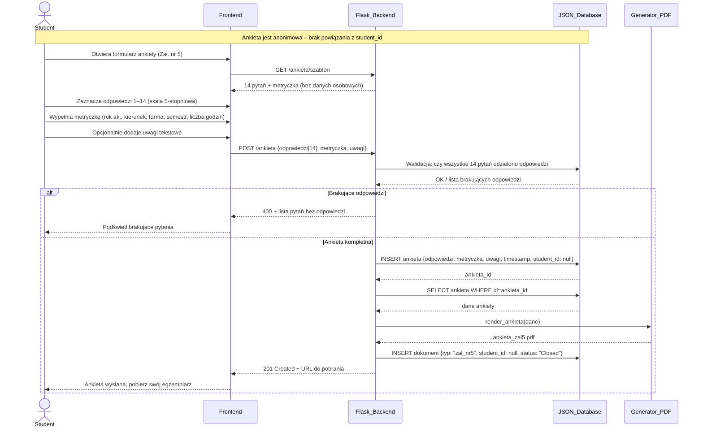

### Proces 5 — Kwestionariusz ankiety
> Dane: Zał. nr 5 (14 pytań w skali 5-stopniowej, pole na uwagi, metryczka: rok ak., kierunek, forma studiów, semestr, liczba godzin; formularz anonimowy).

```mermaid
sequenceDiagram
    actor S as Student
    participant FE as Frontend
    participant FB as Flask_Backend
    participant J as JSON_Database
    participant PDF as Generator_PDF

    Note over S,J: Ankieta jest anonimowa – brak powiązania z student_id
    S->>FE: Otwiera formularz ankiety (Zał. nr 5)
    FE->>FB: GET /ankieta/szablon
    FB-->>FE: 14 pytań + metryczka (bez danych osobowych)

    S->>FE: Zaznacza odpowiedzi 1–14 (skala 5-stopniowa)
    S->>FE: Wypełnia metryczkę (rok ak., kierunek, forma, semestr, liczba godzin)
    S->>FE: Opcjonalnie dodaje uwagi tekstowe
    FE->>FB: POST /ankieta {odpowiedzi[14], metryczka, uwagi}
    FB->>J: Walidacja: czy wszystkie 14 pytań udzielono odpowiedzi
    J-->>FB: OK / lista brakujących odpowiedzi

    alt Brakujące odpowiedzi
        FB-->>FE: 400 + lista pytań bez odpowiedzi
        FE-->>S: Podświetl brakujące pytania
    else Ankieta kompletna
        FB->>J: INSERT ankieta {odpowiedzi, metryczka, uwagi, timestamp, student_id: null}
        J-->>FB: ankieta_id
        FB->>J: SELECT ankieta WHERE id=ankieta_id
        J-->>FB: dane ankiety
        FB->>PDF: render_ankieta(dane)
        PDF-->>FB: ankieta_zal5.pdf
        FB->>J: INSERT dokument {typ: "zal_nr5", student_id: null, status: "Closed"}
        FB-->>FE: 201 Created + URL do pobrania
        FE-->>S: Ankieta wysłana, pobierz swój egzemplarz
    end
```
