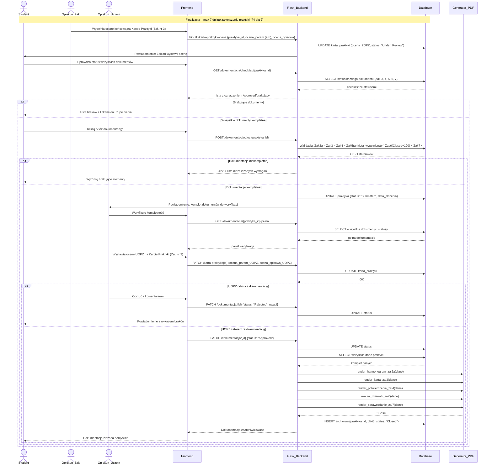

### Proces 6 — Kompletacja i złożenie pełnej dokumentacji
> Dane: Agregacja Zał. 3 (ocena ZOPZ 2–5 param. + opisowa), Zał. 4, Zał. 5, Zał. 6 (120 dni), Zał. 7 (ocena UOPZ 2–5). Termin: 7 dni po zakończeniu praktyki (§4 pkt 2).

