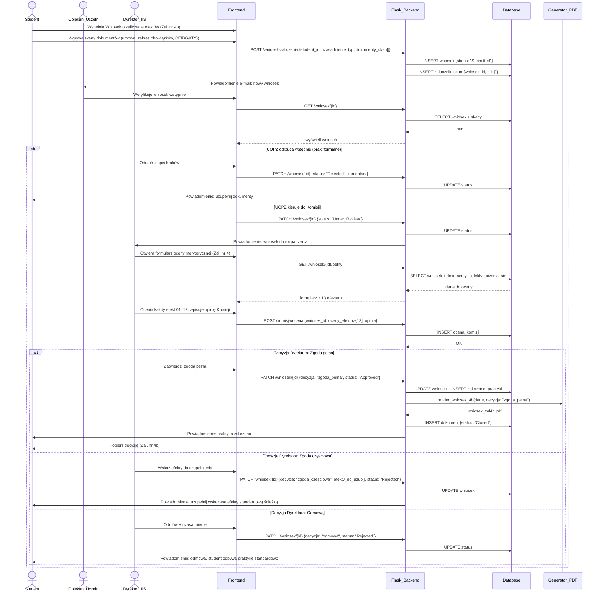

### Proces 7 — Ścieżka alternatywna: zaliczenie przez pracę zawodową
> Dane: Zał. nr 4b (uzasadnienie, typ: praca/staż/działalność, lista skanów: umowa / zakres obowiązków / CEIDG lub KRS; opinia komisji; decyzja Dyrektora: zgoda pełna / częściowa / odmowa). Podstawa: §4 regulaminu.

