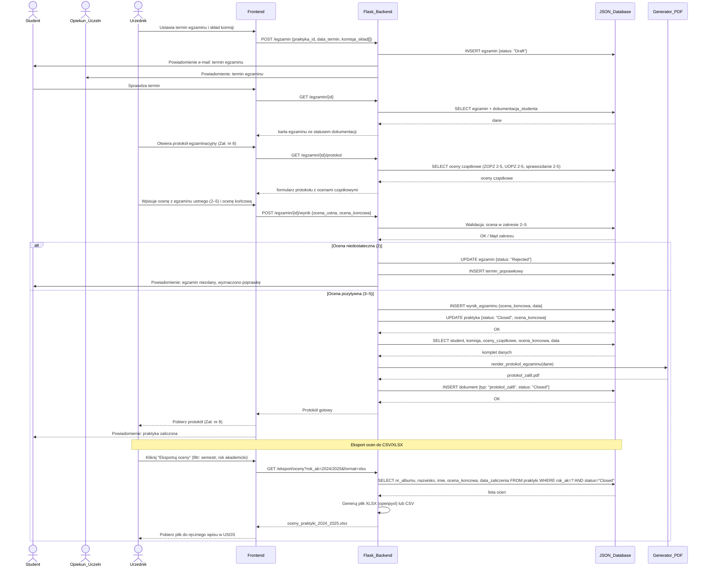

### Proces 8 — Egzamin ustny i eksport ocen
> Dane: Regulamin §4 pkt 5–10 (egzamin przed Komisją, protokół Zał. nr 8), Zał. nr 3 (oceny cząstkowe ZOPZ i UOPZ 2–5), ocena sprawozdania 2–5. Eksport do CSV/XLSX z kolumnami nr albumu, nazwisko, imię, ocena końcowa, data.

