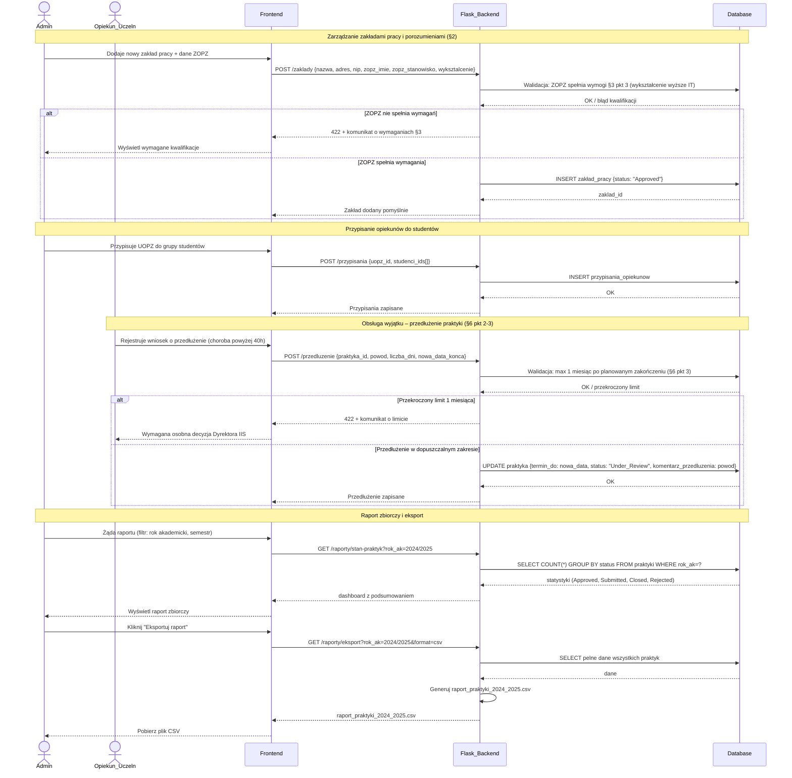

### Proces 9 — Administracja systemu
> Dane: Regulamin §2–3, §8 (porozumienia z zakładami, kwalifikacje ZOPZ, przypisanie opiekunów, obsługa wyjątków: przedłużenia do 1 miesiąca §6, przesunięcia terminu, studia zagraniczne).

